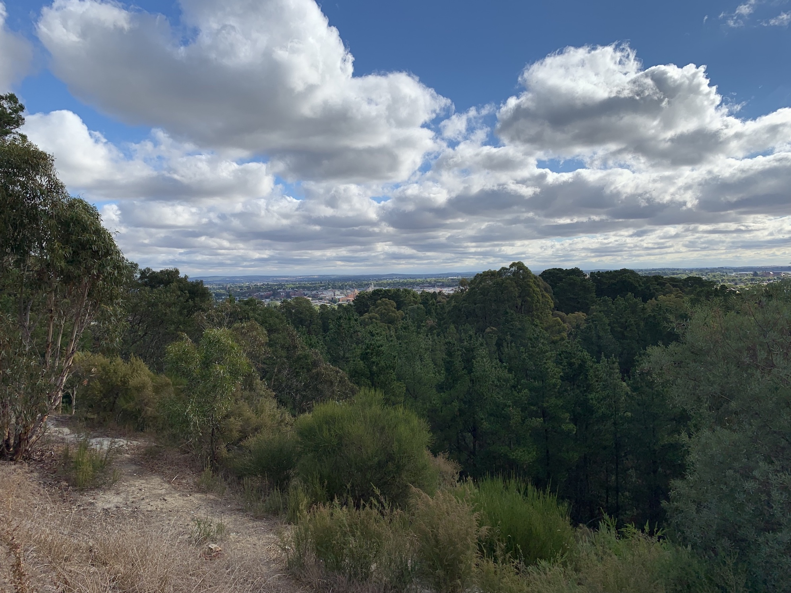
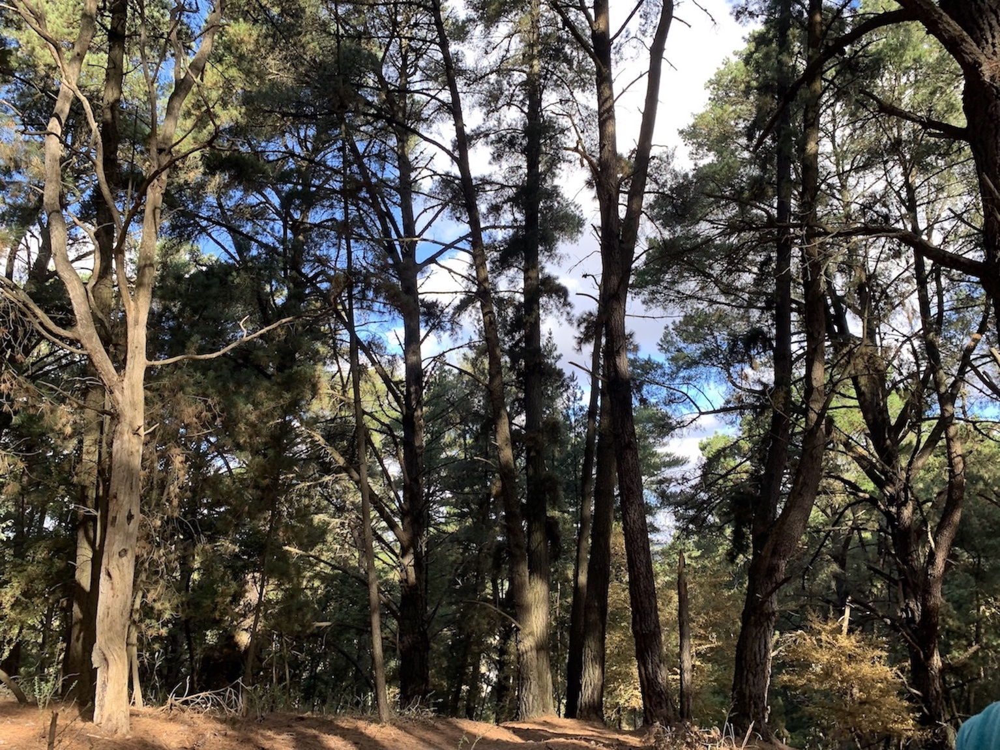
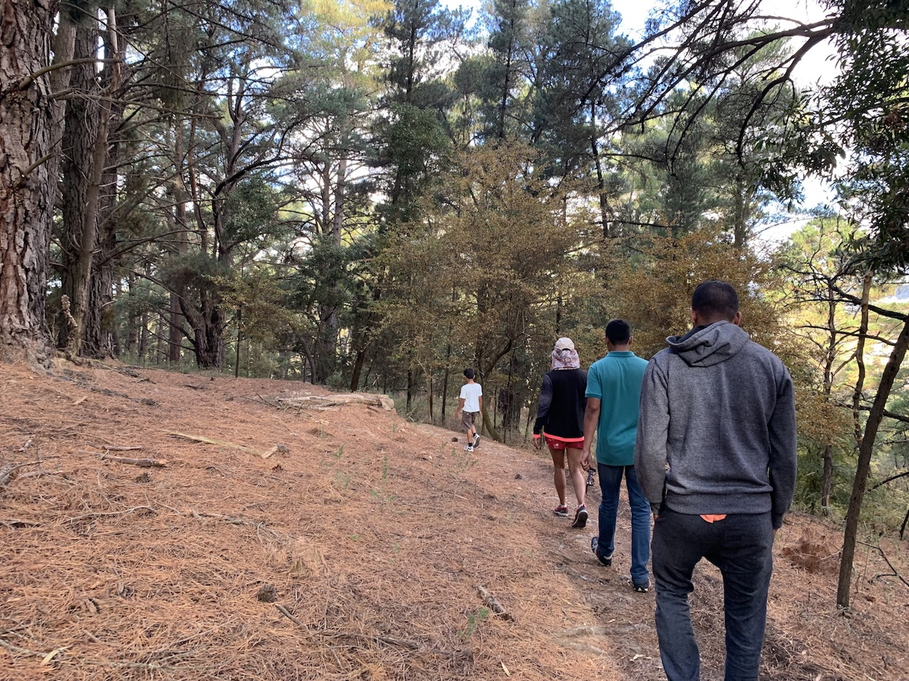

The slow fading summers and a nice long weekend called for a celebration. The beautiful begonias were not late to the party and indubitably the best dressed. Incase you missed the , you will have to wait patiently till next year for the pretty begonias to bloom.

What you can do, however ,is a lovely walk around a parkland which offers some incredible views over Ballarat.
We were looking for a quick hike and came across the _Black Hill Reserve_. It is just minutes from the Ballarat CBD and my first thought on reaching there was - Sunsets would be so great from this hill!
What make it most outstanding though is, mountain biking.

Most of the walks around the reserve are mountain bike trails. However if you want to flex those calves, it really doesn't matters which path you take here.Throughout the incline is quite steep and slippery so make sure you have some good shoes to strengthen your grip.
The walking tracks head off around the reserve in all directions, the bike tracks are marked with signs - walkers must avoid these tracks for safety. The walks are very scenic. Since it is the start of fall, the ground was covered with pine cones and the air was full of the woody savor.

You have towering pine trees all around as you descend into the beautiful open cut gorge, a remnant of the site's mining days. All along the walking tracks you will find gorgeous scenery and some parts open up to offer fantastic views.

Fun Fact : Black Hill forms part of the auriferous quartz ranges in the Ballarat region. Black Hill was a difficult area to mine, as the area had no water supply to wash dirt and remove the gold. Miners had to bag the dirt, roll the bags down the hill and wash it in the Yarrowee Creek.

Key remnants of mining activity remains including the visible scarring and debris form the open cut era, vertical and horizontal shafts, foundations that may be attributed to the crushing battery, two concrete structures possibly used to house explosives and brick kerbing.The Black Hill precinct is important as one of the few visible and generally untouched mining sites left in Ballarat.

Currently there are no toilets or barbecues around the park but that should not stop you from having a good time at the top.
