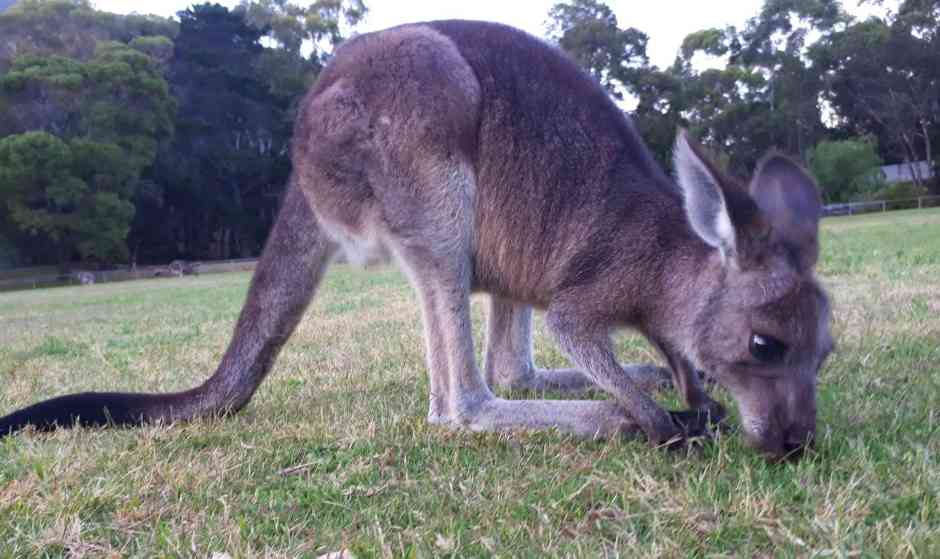

Australia is known for some rugged fun & Camping tops the list. We, noobs ,were yet to experience this chose _Camping in Grampians_ over the Christmas break of 2018. O What fun to celebrate hiking!

**Our trip breakdown**

Travel - _25 Dec -27 Dec_

Weather - _Dry Hot_

####Day 1

| Activity        | Rating       |
| --------------- | ------------ |
| Camping         | ❤️️❤️️❤️️❤️️ |
| Halls Gap Hike  | ❤️️❤️️       |
| Splitter Fall   | ❤️️          |
| Booroka Lookout | ❤️️❤️️❤️️    |
| Mckenzie Falls  | ❤️️❤️️❤️️    |

####Day 2

| Activity              | Rating       |
| --------------------- | ------------ |
| Kangaroo/Emu Spotting | ❤️️❤️️❤️     |
| The Pinnacle          | ❤️️❤️️❤️️❤️️ |
| Silverband Fall       | 💔           |
| Bell-field Reserve    | ❤️️❤️️❤️️❤️️ |

####Things to keep in mind

- _Water!_ There is a drinking water refill station at the city center, Halls Gap. However most walks are elevated(clearly we are climbing mountains). Even is the distance is 850m ,the elevation and heat can dry you out. It is advisable to carry fluids to keep you hydrated.

- _4WD_ . Most camping areas have mud roads which standard cars can tread. However Gramps does have a couple of 4WD Adventure. Lets say things can get more comfortable with a 4WD.

####Things we enjoyed the most

- _Bell-field Reserve_ .
  Imagine two parched hikers on a sultry hot day. They are left disappointed by the Silverband falls(summers had dried it up). They look on the other side of the road and see a hint of glistening blue. They took the chance and Eureka! This was the highlight of our trip!! We ended up spending half our day by the lake, nestled between tall mountains. We had a small picnic and the lake was a perfect accompaniment. There were very few people lazing and we had the lake pretty much to ourselves.

  -_The Pinnacle_ .
  The most popular hike here and guaranteed stunning views. It is a 3.2km hike from the Wonderland carpark. Mind you, the elevation Max elevation: 691 m. Min elevation: 423 m. A hiking stick would really help. The path is well defined and the sights all along the track are great. However the lookout on the top has some awe inspiring sights.
  

  -_McKenzie Waterfall_ .
  On a 35 deg day, this place is a blissful haven! It tumbled down the mountain and pounded against the rock.The bliss-pool at the bottom was varnish clear. A sweet invite to come and dip! There are a couple of easy walks that you can do around the fall.
