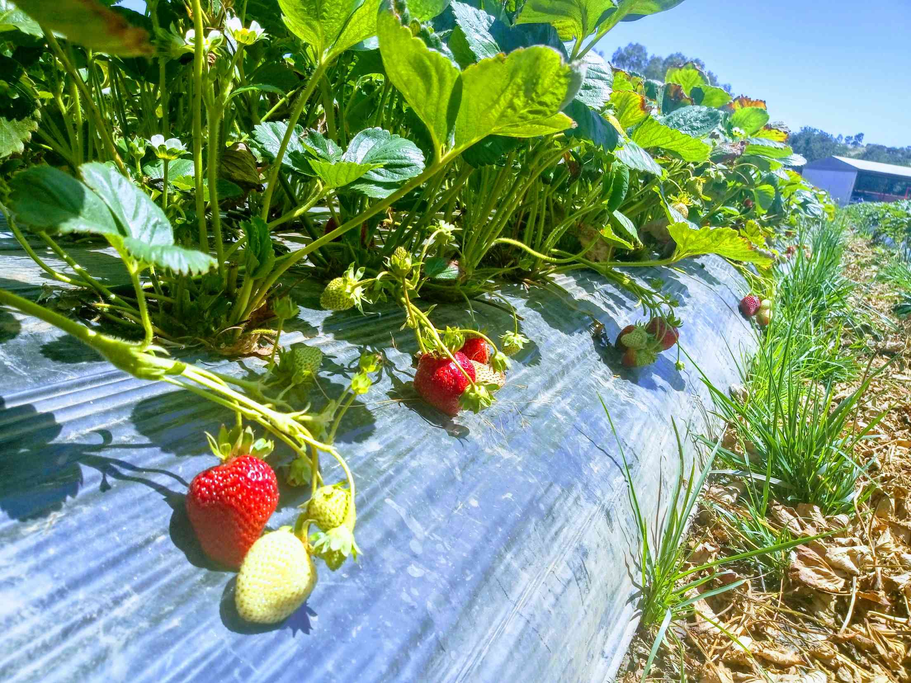
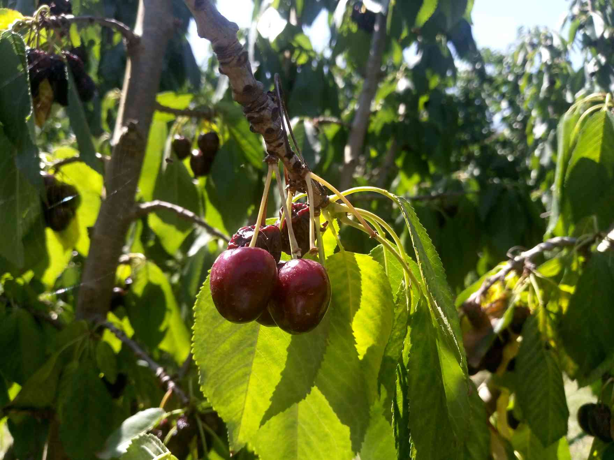
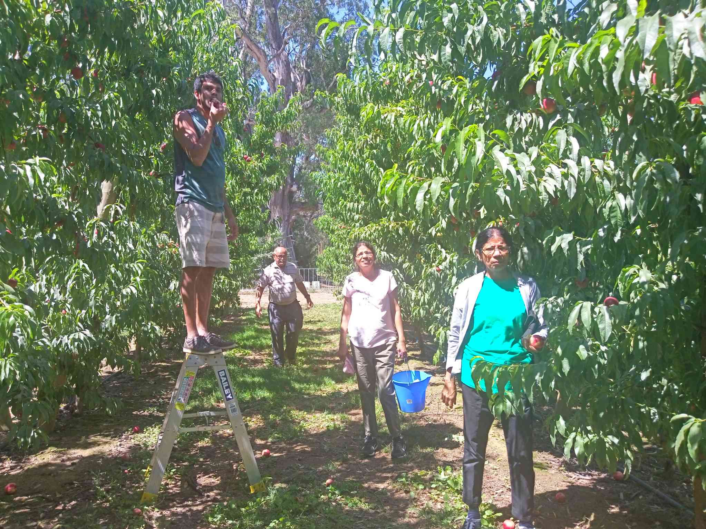
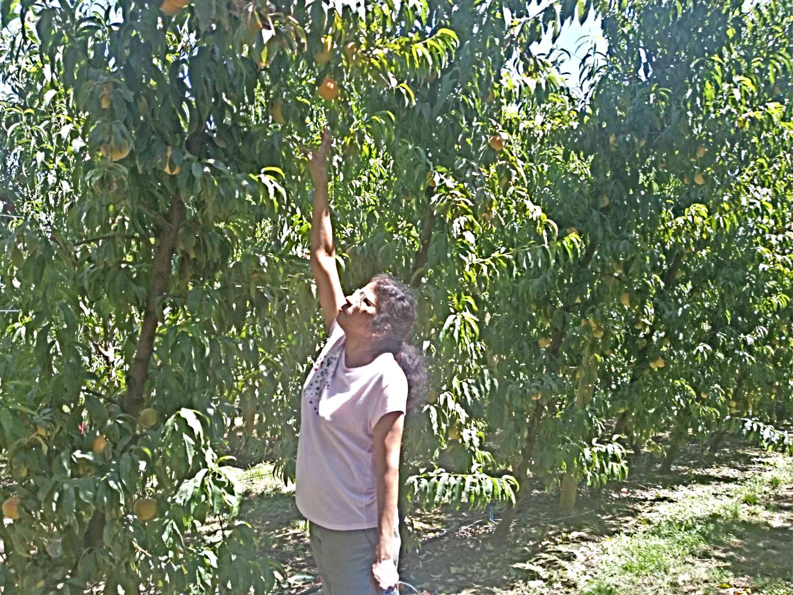

So Mister & Missus Pinto are visiting us!! Woohoo!! We are thrilled and super excited to show them around and take them to our favorite places in Melbourne. The fresh food markets are sure highlights of Melbourne. While the markets are on our list ,we wanted them to have an enjoyable yet unique experience. Knowing my mother, fruit picking was a clear answer! We knew it would be an experience they would thoroughly enjoy.

There are plenty of orchards that allow you to pick your own fruit.

> TOP TIP: If you are looking to pick a particular fruit, make sure you look up their fruit chart. It is generally on their website . It has information if the fruit is still available on trees or not.
> 

We visited around mid January. It was the last week for cherry picking. We chose to visit [Naturipe](https://www.naturipe.com.au/ 'Naturipe Bacchus Marsh')
We have previously picked cherries at Paynes Orchard[ Next door ](https://www.paynesorchards.com.au/ 'Paynes Orchard') and were happy with our first experience. However cherries were only at Naturipe.
There are lines of orchards and you could safely go into any

We were blessed with a warm sunny day and plenty of fruit. We arrived at 11 am and we were late by Aussie standards. The strawberry fields were bustling with families picking fruit. The very experience of breaking your own fruits and popping it straight into your mouth....Now nothing can get more fresher than this!!!

We went straight for the cherry trees. For the end of season we were lucky to have cherries on the tree.Most cherries had dried and the ones left were squashy. Nevertheless it was fun eating fruit fresh off the tree.

The fruit gang next descended on the stone fruit . White and yellow nectarines,peaches and apricots. It was such joy to see trees laden with fruit. Even the birds could not resist the sweet tasting fruit.
It is a joyous experience as we connected with our daily food . It was a reminder to eat more locally produced fruit for many varied reason. When you see your food grow it makes me think of the difference between all the processed food, produced in factories consumed vs this fruit of love and labour ,mother nature gives us.
[Cherry trees](./cherry-picking.jpg)

This is a family activity where kids and oldies can enjoy .
Did my folks have fun gathering fruits? Two days has passed and my mom can't stop raving about that sight of trees laden with fruit.
What did we do after??? Well my next post should say;)
