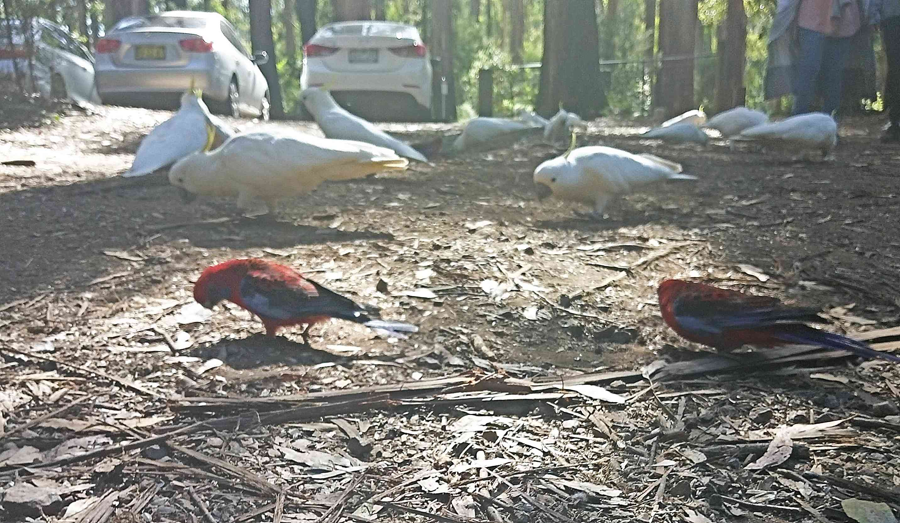
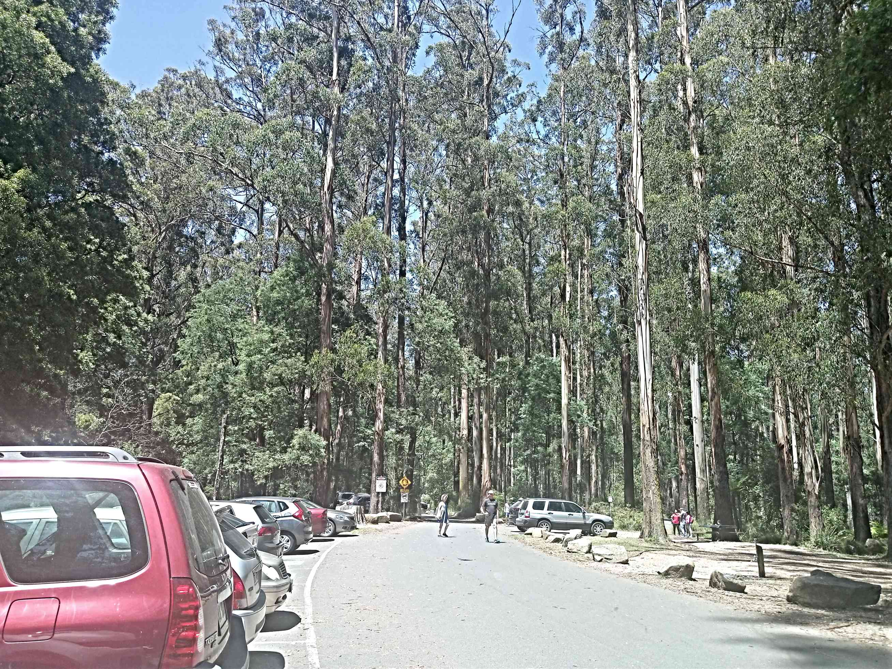
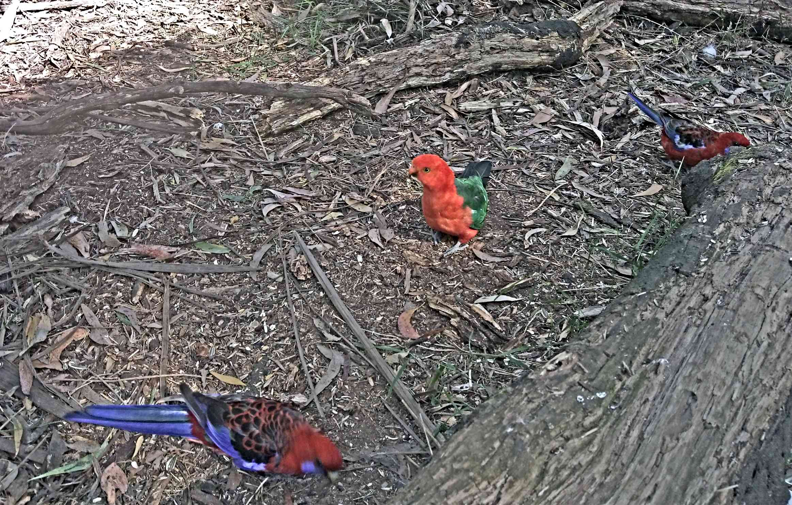
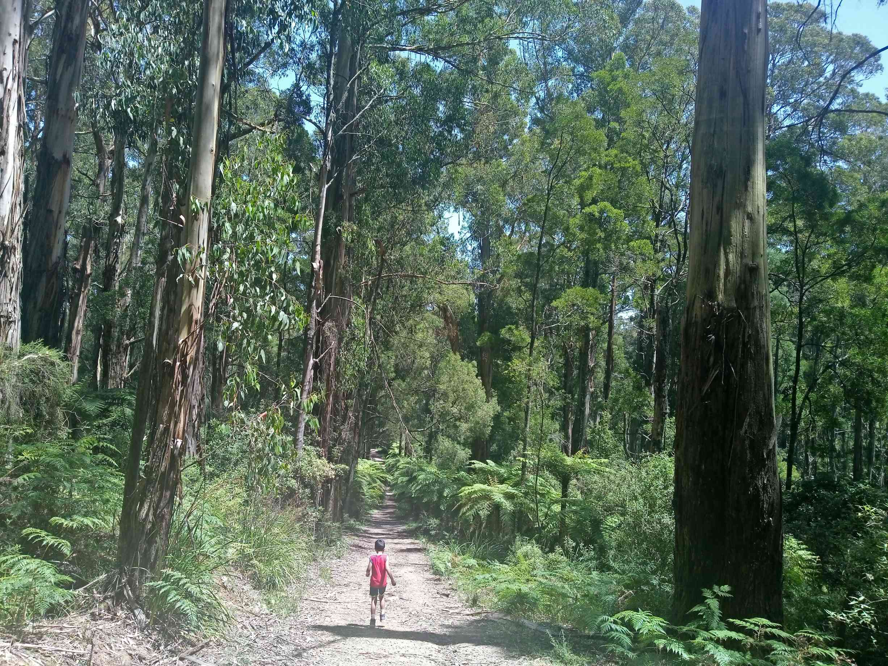
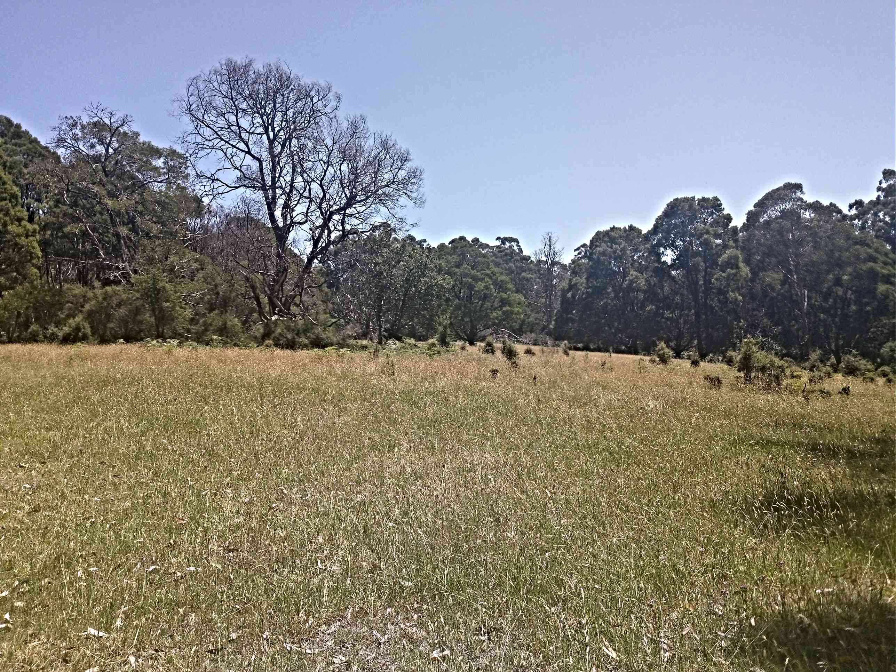

In Melbourne ,it's a waste to spend beautiful weather indoors! Or so we feel!! Come weekend ,we are scurrying for places to work out those calves and be one with nature.
Coming from Mumbai, helps me value the blue skies, abundant green and magical wildlife of this continent much much more. Nature is indeed so therapeutic.

So here's a quick rating of our hike

| Location   | Lyrebird walk ,Neuman ,Paddy circuit |
| ---------- | ------------------------------------ |
| Trail      | Circuit walk                         |
| Distance   | 6.9 km                               |
| Time       | 3 hours                              |
| Elevation  | 294m Max                             |
| Difficulty | Medium                               |
| Start      | Grants Picnic Grounds                |

###Things to note###

- As always there are multiple trails starting from Grants Picnic Ground. Once again if you don't feel like a trek, this place has a lovely cafe and a bird feeding area (paid) both of which are quite popular.

> The highlight -> the many many rainbow lorikeets, orange breasted parrots , parakeets... Such-a riot of colours and sounds !! (Not to forget the cackle of our outrageously brazen cockatoos is second to none)
> 
> It feels like you have just entered an aviary.

- We chose to do the Lyrebird walk. The walking tracks are well signed and you cannot get lost.[Signage](./signage.jpg)

  > These tracks are kid friendly and safe. Also this place seems to be quite busy and popular. People from all walks of life and age come for their dose of exercise.

- The path is lined with tall Manna gum trees. On a 32 deg day we were soothed by the shade and survived the elevation. 

- Overall we would rate it as an _average_ hike. With most of the walk being on flat ground, its perfect for families and all age group. The birds and the green scenery provides perfect accompaniment.
  

In all its a great place to spend your weekend amidst the birds native to Australia! Would definitely come back with my mum and dad.
