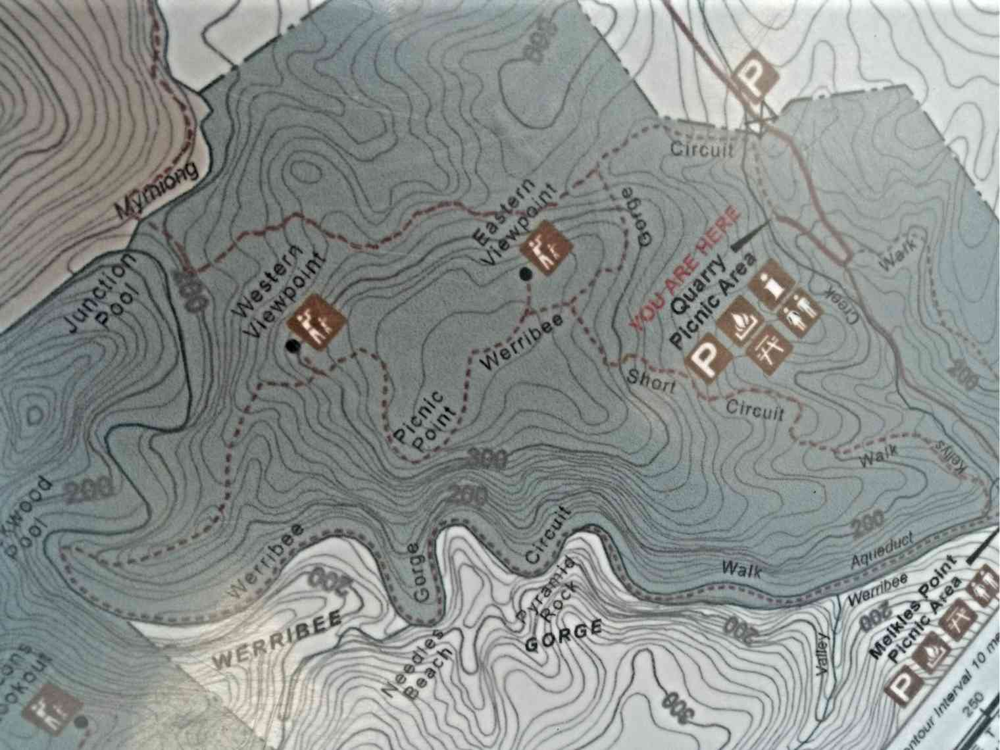
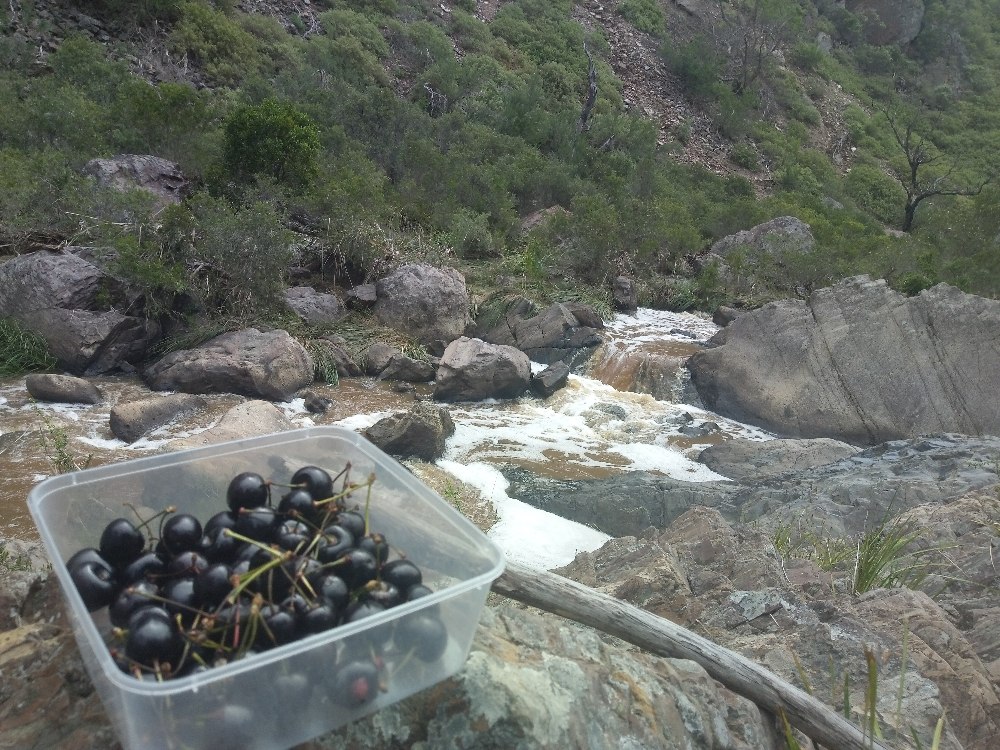

| Location:  | Werribee Gorge State Park |
| ---------- | ------------------------- |
| Trail      | Circuit walk              |
| Distance   | 10.5 km approx            |
| Time       | 3-4 hours                 |
| Elevation  | 348m Max                  |
| Difficulty | Medium                    |
| Start      | Quarry Picnic Area        |

###Things to note

1. Multiple entrances to walking track. However the trail is mapped only at the main parking . Choose to start from the main parking as the track is defined there.

2. Poor signage. Extremely easy to get lost. Always keep the map handy.
   

   Our first visit was wonkish thanks to 1 & 2.
   Luckily we stumbled upon the short circuit track. However we spent 3 hours randomly walking through the park and could only do half of the short circuit. The views were stunning nevertheless.

3. The circuit is a 10km hike . It took us approximately 4 hours with few stops. I would totally recommend doing the hike. The sights are spectacular .The walk along the river is quite an experience with river cliffs part of the climb. Apparently the river is home to platypuses, though we didn't see any.

4. Hiking boots. Well this is one the hikes where hiking boots would be great. Walking poles help especially while descent into the gorge and unruly paths. Parts of the hike are along the river and hence can get quite mucky.
