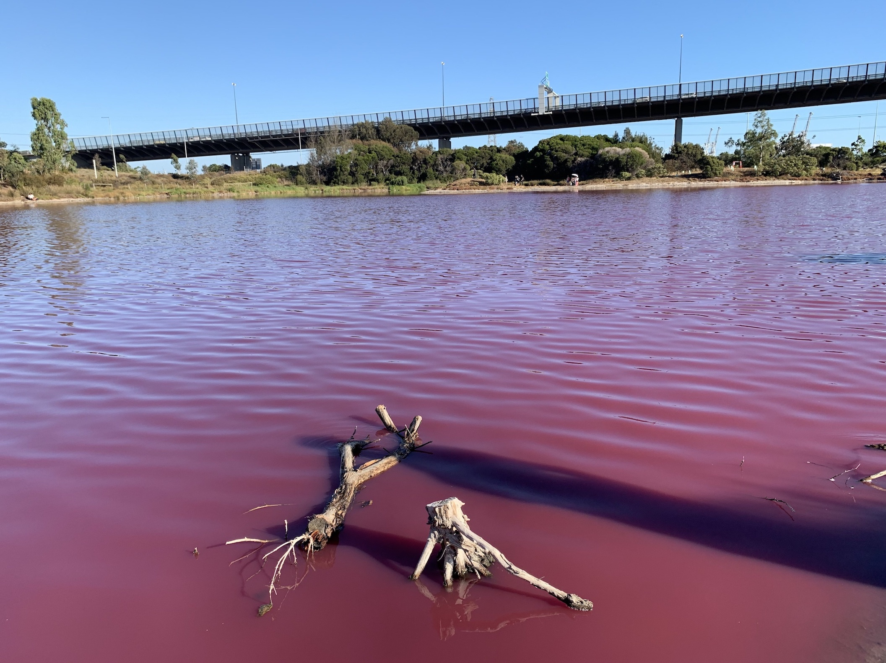
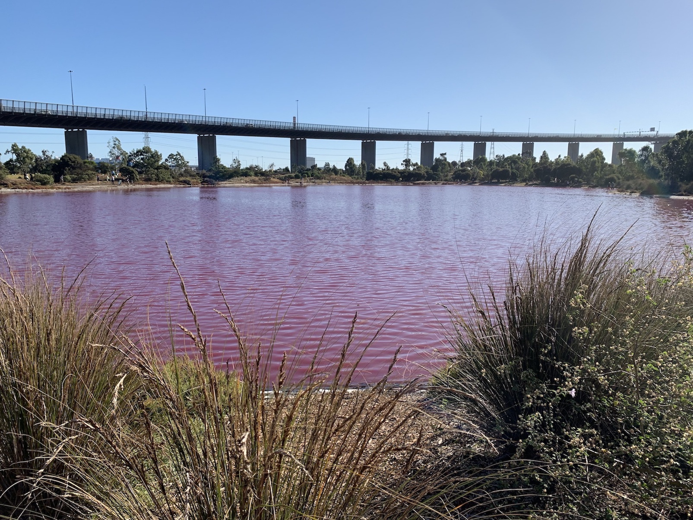
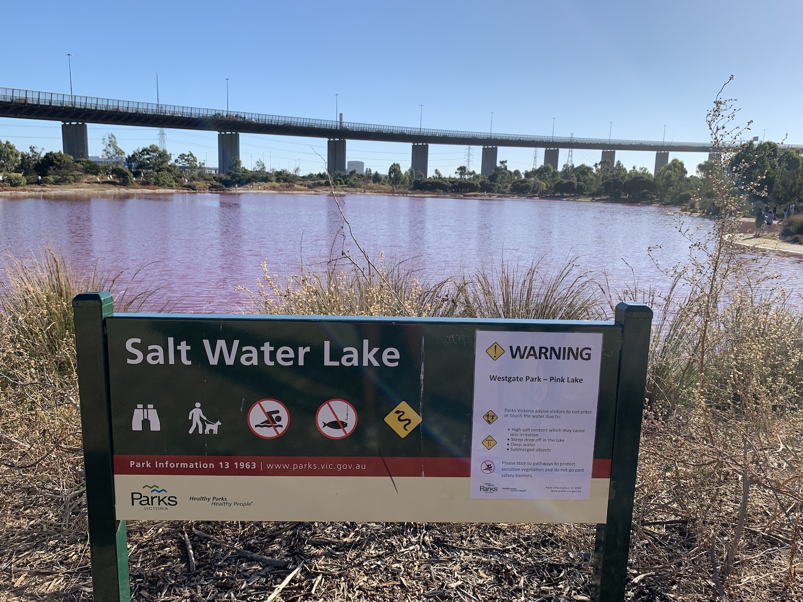

Who doesn't love a good summer tan? In Melbourne a salt water lake is no exception. Just that, Pink is the new brozen!

A Melbourne-west dweller would not think much commuting over the West Gate park to arrive into the Melbourne CBD. However when the day is just right, I am talking temperature, salt content and the water depth ,the usually alkaline somber lake adorns a pinkish hue.

The lake is ,currently as you read this, experiencing ideal conditions for the lakes algae, which grows at the bottom of the lake and feeds of the salt crust, to produce a red pigment as part of its photosynthesis process.

The result is a bubblegum bright pink lake that has to be seen to be believed. Although the water may look strange, the water is actually crystal clear, albeit very salty. No, don't drink it.
This lake is a beta carotene farm at the moment.

On a good sunny evening, it is nice to relax on your picnic mat on the grass by the lake. The West gate bridge against the clear blue sky with this stark pink is perfect for those glam photo opportunities.
With the news of this occurrence spreading, the lake is having a swarm of visitors.

The lake is an amazing natural phenomenon which generally lasts till autumn sets in. The bacteria in the lake is not harmful. However people are advised against entering the lake for their own safety.

Sometimes nature has a very wonky way of teaching humans, chemistry. Make sure you do not miss this class. It's a pity the class is held only once in the year.
