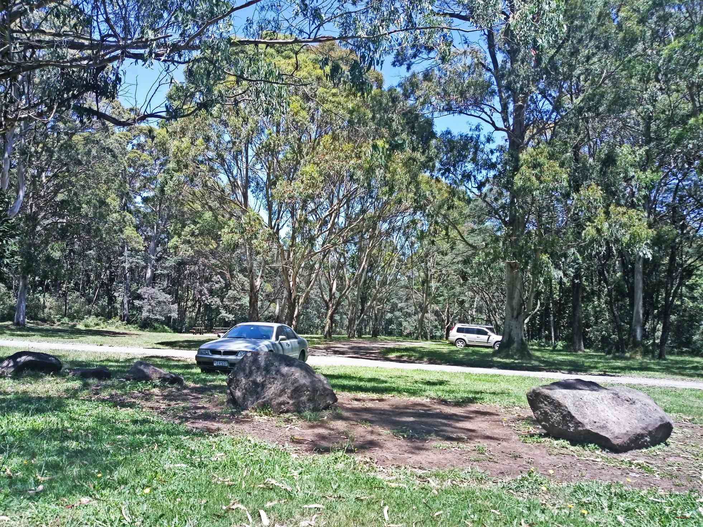
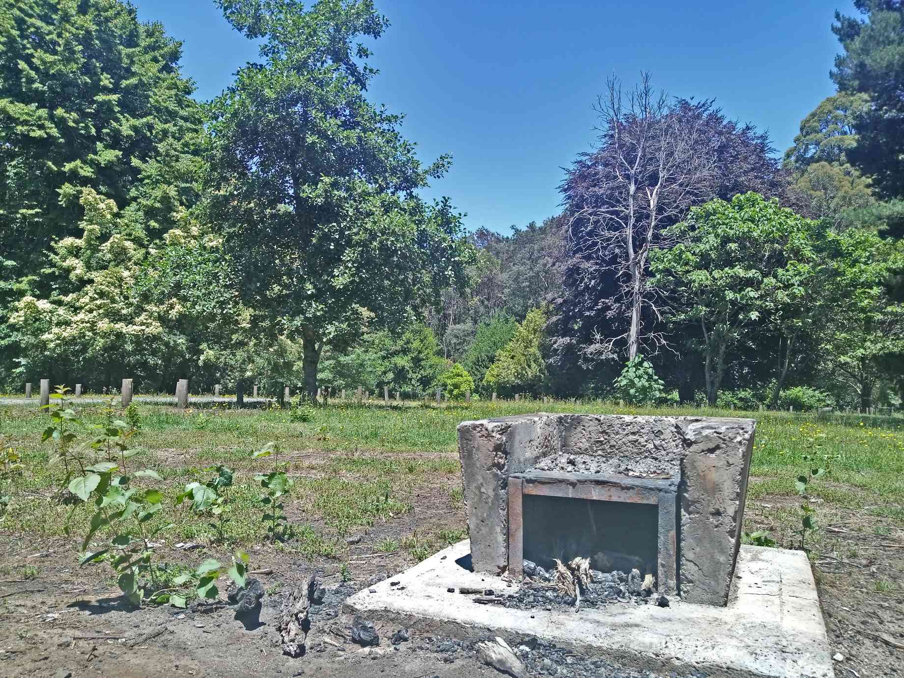
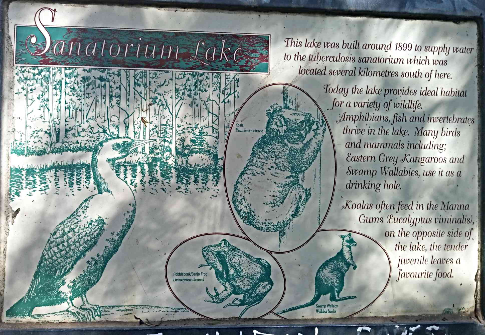
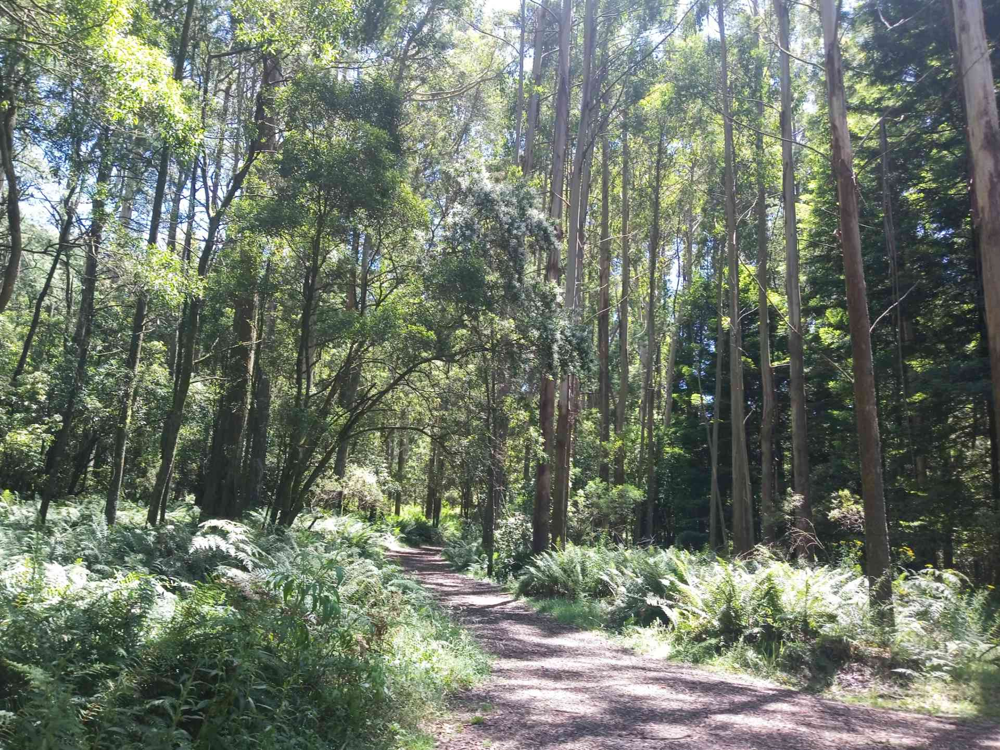
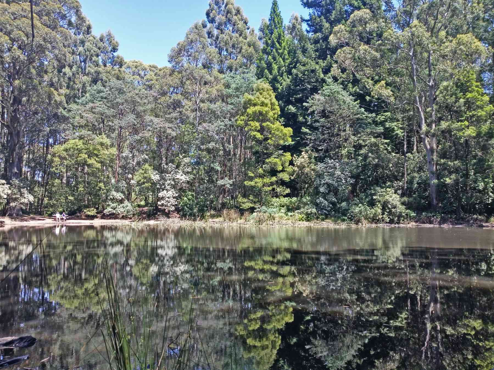

After Grampians,I (a noob swimmer) prefer lakes over the sea. I find them as a an extension of the swimming pool . And familiarity does not necessarily breed contempt, I guess.
Mt Macedon is a 45 min drive from Melbourne and a perfect day trip candidate.

**_Major Attractions_**

- The Memorial Cross
- The Hanging Rock ( made famous in a movie _Picnic At Hanging Rock_)
- Avenue of Honor and gardens like Tieve Tara,Forest Glade ( mainly during fall)

Mt Macedon is a very scenic place and famous for its spectacular show of fall colors on trees. It was to see these colors that we first came. We must say irrespective of the season,this place is beautiful. This time it was the Hanging Rock hike which brought us but we stumbled upon this walking trail which showed a different side of Mt Macedon.

There are signs everywhere in Mt Macedon pointing non-locals to the many points of interest.
It is a safe bet to do an impromptu detour as there are no disappointments guaranteed!!! This place is picturesque anywhere you go.
We saw a sign that said 'Sanatorium Lake' via Lions Head Road and the thought of a nice relaxing swim lead us down the road. The off-road took us to Days Picnic Ground.
Families were having a nice day out with food cooking on pots of fire. Well that was a surprise, as Bush fire signages are all over Melbourne. The shire is actually an exception. It has actually catered for fire pits for families to have an enjoyable meal.

There are well signed walks and horse-riding trails to the Sanatorium Lake, Camel's Hump etc. from the picnic ground. If you don't feel like it, you could just enjoy a nice cool beer in the shade of the tall trees. It simply perfect!
We were still dreaming of my swim and chose the sanatorium lake walk.

The walk is an easy flat one .However it is through this dense foliage of ferns and eucalyptus trees.
I was quite expecting snakes and was a lil nervous. Wombats are apparently the major residents around here and having read that my fears were put to rest. I was now keen on sighting them and kept looking for square shaped droppings.

> Fun fact - Historically, Sanatorium Lake was purpose built to provide a water source to a hospital specializing in the treatment of tuberculosis, which was never built.

After a short 1.5 km walk we could see the lake. For me, the forest was more captivating. Serene yet fierce. It's home to many birds whose chirping keeps you company right through your walk. While our eyes feasted on the sight of green , the hiss of the wind gushing through the trees was unsettling.
The lake is a beautiful setting and unfortunately swimming is not permitted .

_The best time of year to explore the lake is in Spring and Summer._
