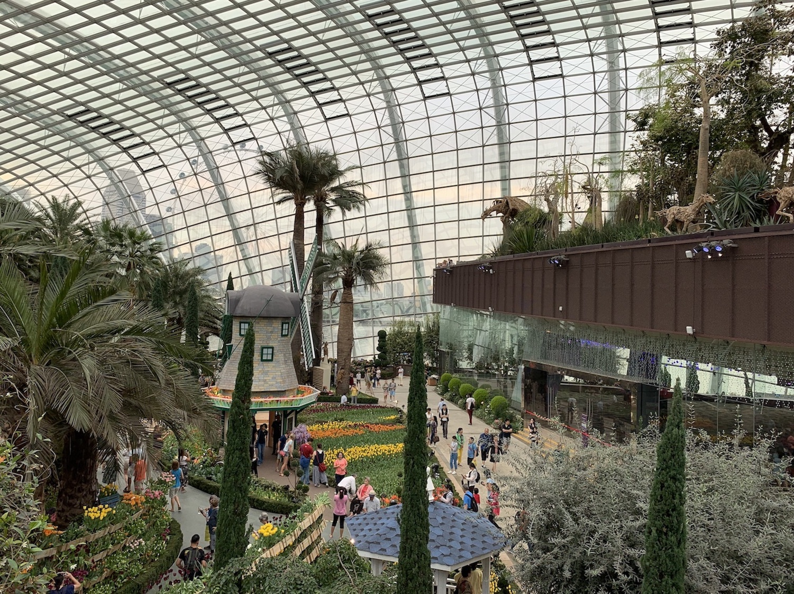
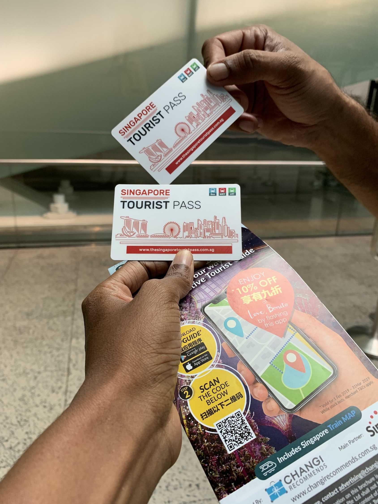
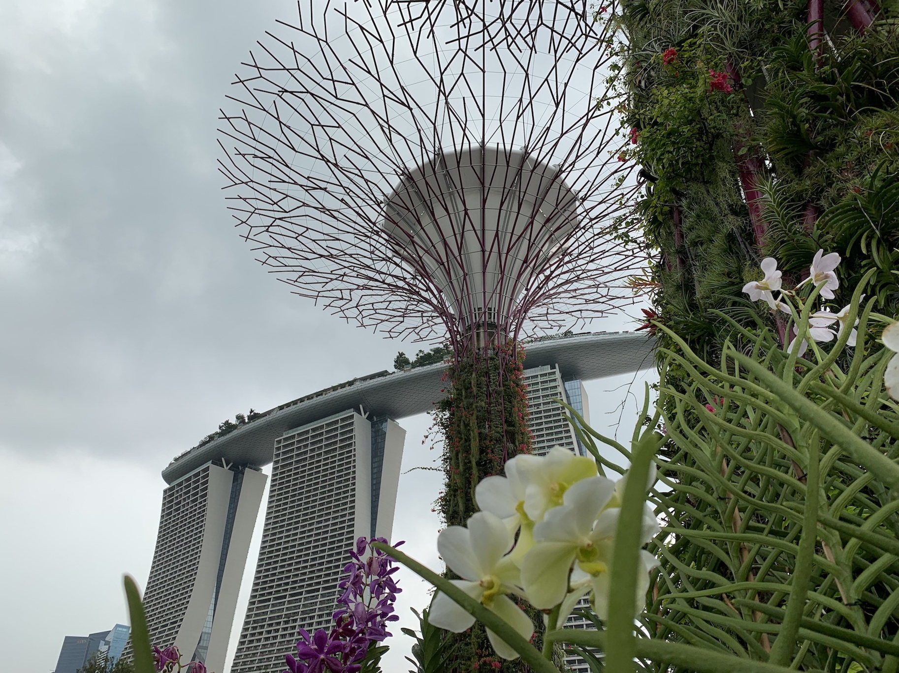
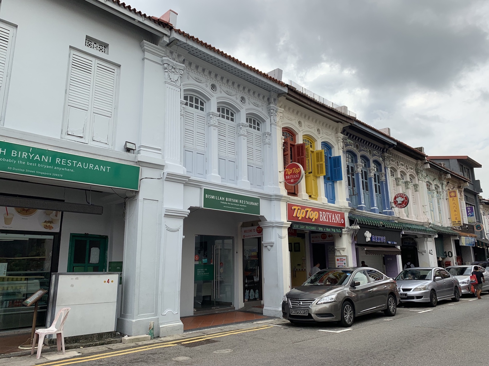
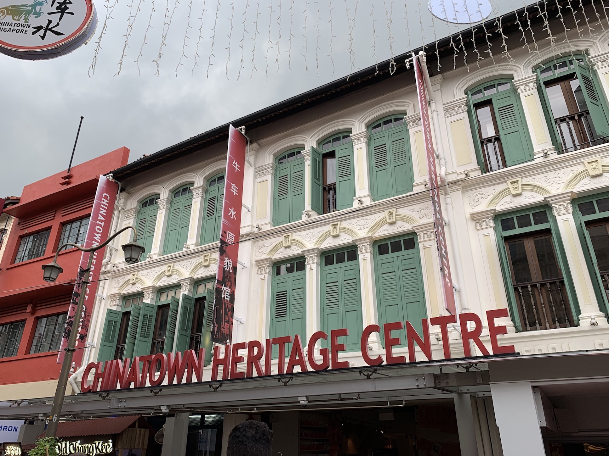

A long stop over between flights is every travelers night mare. Stuck in a small airport without a good book is nothing short of a disaster!! But if that stop over is at the Changi international airport, the equation is quite the converse. We went over to India to visit family this Easter. On our way back to Australia we have an 18 hour long stop over at Singapore and I was simply delighted much to the dismay of my mister.

There is so much to do both at the airport and at the city that ,boredom was not one of my concerns. The decision of how to spend those 18 precious hours of my life was THE concern.

If your layover is any less than 7 hours we would recommend staying and exploring Changi airport or doing the city sights and heritage version of the [ daily tours](http://www.changiairport.com/en/airport-guide/facilities-and-services/free-singapore-tour.html) from the airport. They do justice to your time and money. Make sure you register yourself an hour before the tour timing.

For a longer stop make sure you clear immigrations with a valid visa as it simply demands a trip to this manmade beauty-personified city/country.

**_Australian PR holder are granted visa on arrival._**

The two easiest ways to get from Singapore Changi Airport to the city centre of Singapore are either by taxi or with the MRT train service. The MRT costs around 2 SGD versus the 20 SGD of a taxi. I would personally recommend getting on the MRT . It is simple to commute even for first timers (with no internet access aka Us), quick, efficient and covers all the different areas of the city centre. A taxi instead is quite likely to get stuck in traffic (not that we saw any)and waste you lots of time.

MRT trains are cheap and require an EZ-link card. It is also here that you get your first glimpse of this tourist friendly city. The Singapore Tourist Pass for a single day of U-N-L-I-M-I-T-E-D travel (by any mode of public transport) is $20 SGD where in the card deposit($10 SGD) is paid back on card return!

**Pro Tip:** _if you do not have a SIM i.e. no internet, pick up a free city tourist map. It has great details on how to get to most of the tourist attractions via public transport._

**_Highlights_**

### Visit the Gardens by the Bay

Gardens by the Bay are possibly the most recognizable attraction in Singapore. We have all seen photos of the humongous trees at night lit up with lights. Since we were spending such a brief amount of time in Singapore, this was definitely at the top of my list of places to see. The magnanimous metallic Super Grove trees illuminated are a treat when watched from the Marina Bay Sands hotel and I would suggest going there for the night show. During the day however, you can take a closer look at these giants and walk right under them for free! There are additional paid attractions at the Gardens like the Cloud Forest, Flower Dome and the Skywalk.
Discounted tickets can be purchased via [kkday](https://www.kkday.com/en/product/3158).
So _Be ready to do some serious walking_. There are shuttles to the Dome at a fee of \$3 SGD.
Surely a must do for all those gram photos or even to just soak in some green.

Brownie Points - The Gardens by the Bay was built keeping Mother Earth in mind. The super groves have solar panels on them which is used to power the light show in the night. The rain water is harvested and used to water the plants in the area.

### Little India

The Indian imprint on Singapore's urban landscape can be seen most prominently in the form of the Little India neighborhood. The area is famous for its bright colored house ,however the house of Tan Teng Niah takes this to a whole new level. A quick ride on the MTR will get you to this explosion of colors and you will find yourself entering a different version of Singapore. Temples, shopping complexes and eateries mainly dominate the area. However the best way to soak in the beauty of this place is by sauntering through the by lanes ,enjoying a dosai at the local eatery and then back to strolling.

### Chinatown

Continuing on the streak of original names, Chinatown is the main Chinese hub in Singapore. It's fairly close to Little India and is a very interesting area of Singapore to explore. Composed by a maze of narrow streets in Chinatown you will find all sorts of street food stalls, souvenir shops, indie boutiques, trendy wine bars and much more. If the Singaporean heat is becoming a bit too much you can also take refuge in one of the big malls dotted around Chinatown, there's nothing like a bit of shopping and air-con to cool you down!
The Chinatown Complex Food Center is one of the best places in Singapore to eat. With a wide offer and very attractive prices, let yourself be amazed and, being in Singapore, I can not fail to recommend that you sample the Chilly Crab but be careful, it can be real spicy.

### Marina Bay Sands

This is an iconic resort complex that faces Marina Bay in Singapore and it features The Shoppes at Marina Bay Sands mall, a museum, two large theaters, restaurants, Crystal Pavilions, art-science exhibits, casinos and so much more! SkyPark Observation Deck which is located here provides breathtaking panoramic views over the city,  this observation deck also has the world's longest elevated swimming pool with a vanishing edge (a.k.a. infinity pool) that's located 191 meters above ground. (You can only swim in it though if you're a guest of the hotel; but still and the same, this is a great spot to be in but you need to buy entry tickets.
