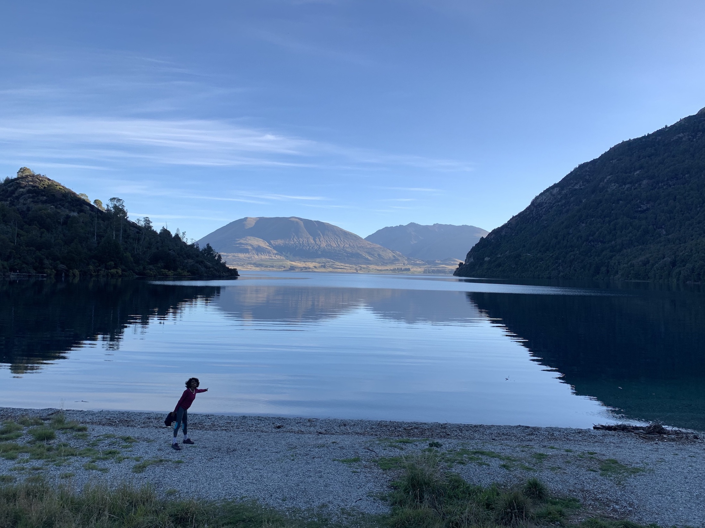

New Zealand is not your regular ,_"light-on-the-pocket"_ holiday destination. However its hard to resist the temptation aroused by your insta feed repetitively bursting with pictures of clear pristine lakes surrounded by steep steely mountains or coniferous greens. Well I literally want to have a slice of this cake and eat it too. An enjoyable and fulfilling experience well within our budget- was our mantra. Did we manage to do it?

## Here's a quick breakdown the 8 Day trip expenditure

**Travel (incl. camper van + excess + insurance)** => _\$1200_

**Flights** => _\$550_

**Grocery** => _\$200_

**Misc ( Sky dive + Milford Sounds cruise)** => _\$700_

A grand total of \$1970 for two people for 8 days. These 8 days involved ample driving around , eating some fantastic meals and snacking( cummon ,its a road trip) and star gazing.

## Couple of pointers about the South Island

- Avoid doing too many things in a short time. You will only end up tired and dissatisfied as the south island is vast. Even if Google maps says that its just 6 hours between Queenstown and Christchurch, do not fall for it!!! (Learn from our mistakes.The drives were picturesque nevertheless. ) Those 6 hours are minus the photo op stops and involves some hard core ,laborious, continuous driving. Mind you,most of the South island has these beautiful extravagant mountains which also makes most of your journey winding. You need to be cautious and aware. So why not stop, enjoy the scenery and then drive by.

- Weather can change quite drastically here.A perfectly bright clear sky can be transformed by the rolling in of clouds to being dull and outcast and then suddenly to a outrageous downpour. All while the clock's hand moved just a couple of inches away.

- It would be smart to base yourself in Queenstown as it is the hub of all road connectivity . An aerial view would make Milford Sounds and the Fox Glacier, neighbors, with just a fence (of mere mountains) separating them. However in reality ,they are 12 hours apart as there is no road through those mountains. All roads lead to Queenstown which helps in ways Ill talk about later.

## Pointers on where you could save some money

1. #### Campervan/Vehicle

   As you can see a major slice of the expense pie is eaten by our campervan. We chose to go with Britz. It was our first experience campervaning and we weren't sure what to expect. Would there be enough space to sleep, how would we manage out loo breaks, cooking etc. Britz seemed to be a safe bet and we were fine with that extra expense.
   Madcampers and Juicy are the other economical options available. Judging by popularity amongst campervaners on our trip, Juicy is popular for short stays while Britz for longer durations.
   Also keep in mind fuel ,especially diesel, is more expensive as compared to Australia.

   > Pro tip - All diesel vehicles have to pay a surcharge for traveling every 100 kms of `$6.70`.

2. #### Flights
   Jetstar has some insanely awesome `Return For Free` deal . If you manage to time your holiday to match the deal then you score. Also these deals generally run 6 months before your travel dates. So you can plan and save some flying costs.

3. #### Groceries
Cooking most of your meals will really help reduce cost. Pak n Save and Countdown(the kiwi version of Australian Woolies ) are great for your grocery purchases. Major cities have super markets and the prices can vary. However having that smashed avo on toast at home instead of the city cafe helps. I know holidays are all about treating yourself so you can still indulge in that no sugar skinny latte at the cafe.

4. #### Plan your trip
   This involves a lot of time and effort. However the rewards are great.
   If you plan your trip, your itinerary wont have you spending much time on the road.You can chose to spend that time chilling by a lake or under a waterfall. Sounds so much more pleasant right. It will also be low on your pocket.
   If you are campervaning , you can map out all your freedom camping spots. Mind you some of the popular freedom camping areas come at a nominal fee. If you avoid /forget to pay up you will be woken up by a DOC official or worse , fined \$200, for your free stay.
   Planning ahead can also help you score some amazing deals on car and accomodation.

So get out there and I am sure you will be submerged by the surreal beauty of the south island.
Make sure you have packed your hiking boots, Coz these mountains are calling and you must go!

