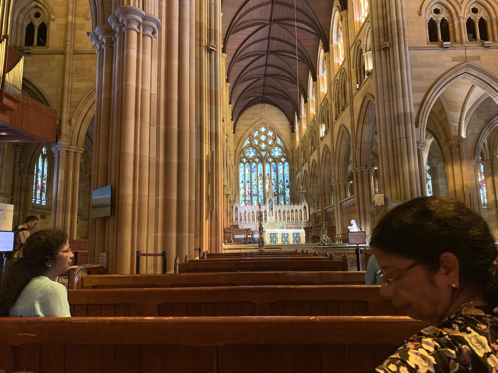

You haven't seen Australia if you have not seen Sydney. Period.
Love it , Hate it but you just cannot ignore it.
It was my fifth visit to this pulsating ,fast paced fashion capital of Australia.And it was this time that I fell in love with Sydney. My first four visits were totally nerve wrecking and put me off Sydney.But I guess that's with every place and the pockets you visit.

I asked my mother and my aunt, what was the Australian experience that is etched in their mind. Pat came the reply,the Opera House in Sydney!!!
It made me smile. I am glad they fell in love with the city on their first visit.

I guess it also depends on how you go about seeing the city. If you are more of an without-a-plan explorer (which is the category I fall in), you might miss out on the ingrained beauty of Sydney. You might scum to the commercial trap of Bondi or the Toroonga zoo and miss out on the hidden stars - the quaint laneways of Wynyard or the tranquil Chinese Garden of Friendship that is silently looms in the bustling,busy Darling Harbor.

Don't get me wrong! I have spent several Sydney visits at the bars along Kings Wharf but none of them have awed me. This visit involved meandering the streets, taking in the towering skyspacers and Boy, did I enjoy it!!! The whackiest bit of the city was having a this old artistic two storeyed snuggled right between these shiny glassy modern sky scrapers and yet not sticking out as a sore thumb. It was the perfect amalgamation of the new and the old.

On this visit I was presented with a totally different side of Sydney. We did the iconic Opera House and saw the Harbor bridge (My hobbling parents would not have survived the Harbour walk , that once used to be my best Sydney experience.)
What I brought back from this trip was more learnings about myself and of the city.
The kind of traveler I am and the kind of things I really enjoy . Also Sydney is not all about the crowded suburbs that remind me of Mumbai. The city has a charm that sings of why people fall in love with a place.

A key to this experience has alot to do with the place we chose to stay at during our visit. It was this old popular pub which had a floor they let out.The Wynyard hotel. I would totally recommend the place. Smack in the middle of the action!
The only let down especially if you are a light sleeper, you might not get any sleep at this place.
The location is key. we were just 850m away from Darling Harbor and 1 km from the Museum train station.
Post dinner stroll meant going through the shopping district and watching people move.....

###h2 Highlights

- On the first day after walking around Circular Quay, we took the ferry to **Watson Bay**. This place is yet another surprise.The sight all along the bay are picturesque. Its the ferry ride that is the clincher though. Had it not been for the heat, we would have spent more time around the island. There is a look out right across the park which is passable.
  However on my previous visit I did do a hike along the bay. There are cannon lookouts with a lesson from history written on them. Watson bay also has a light house and a nude beach (wink wink). The light house walk is what I remember doing. The Lady Jane beach is what made it worthy. My first accidental discovery!

- Chinese Garden of Friendship
  It was on my things to see in Sydney thanks to a friend's recommendation. It is a popular tourist attraction for sure . It was quite busy for a Sunday I thought. The garden is spec of garden admist the concrete.
  They have tried to create a sense of calm amidst the chaos and they have done a good job at it. The garden does not seem too cramped or extravagant. However having some picnic area would have clearly helped.
  The garden is inhabited by the Chinese water-dragon and tortoise and koi ponds. A perfect slice of Asia.

- St Mary's Cathedral & Hyde Park
  
  Well if you are after convenience make sure you do the trio i.e Anzac memorial, Hyde park & St Mary's Cathedral. They are all in walking distance from each other. If you enjoy gardens ,this is something you can do.
  

Needless to say , especially if you are checking off the Seven Wonders of the world ,that you MUST do the Opera House. The standing tall white against the deep blue sky and sea is just picture perfect.
It is on my wish list to actually see an opera inside of it. When I hear of a great bargain on the tickets that is! And will surely tell you of my experience.
