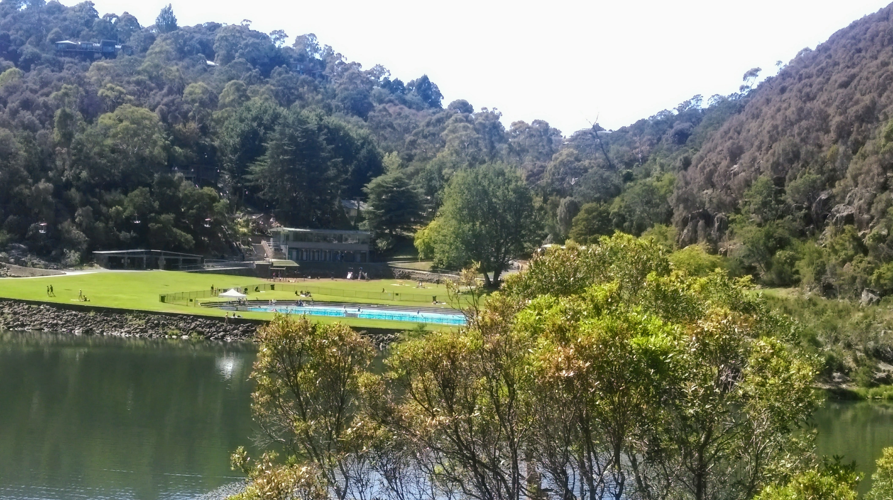
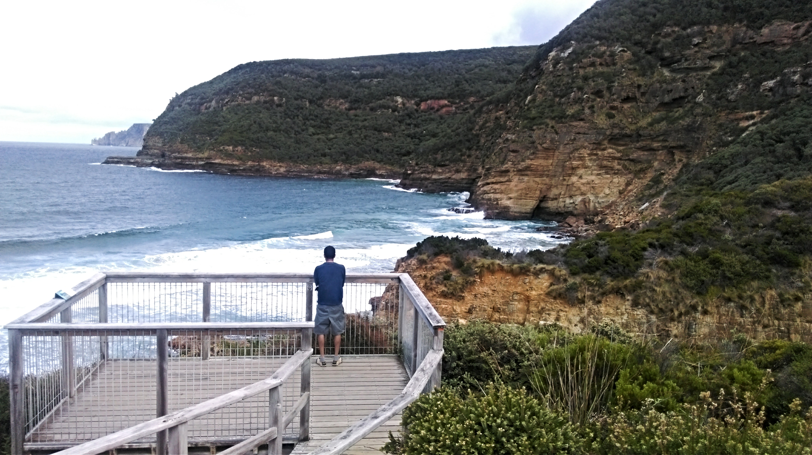
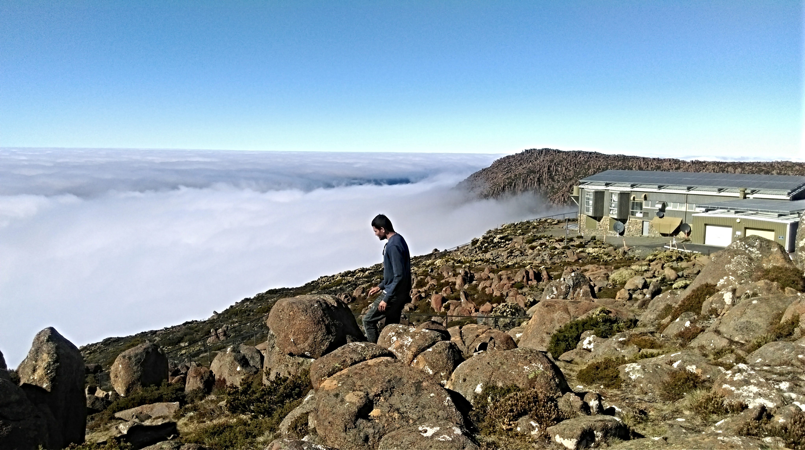

Australia is quite an expensive country when it comes to a holiday. As a migrant to Australia , my first year was all about settling into the new city, new job , new housemates and the long list of news...

> Subscribe to flight deal alerts!! You could get a return to Hobart from Melbourne return for \$90. Jetstar and Tigerair are the budget airlines most locals prefer.

Now that your flight has been taken care of, another deal breaker is accomodation. While on a holiday, depending on whether your a family with kids or just a no-frills couple ,your travel itinerary and budget decides your choice of accomodation.

This was our first trip together and we are the 'a place to spend the night after a day on the road' couple. Past experiences with AirBnb were great so we decide to go - AirBnb!.It helps having tentative itinerary.We wanted to do Hobart, the Cradle Mountain and Launceston. So we broke our journey at these places.

Tasmania is relatively small however a drive from Hobart to Launceston takes a good 4 hours. It helps if your night stays are booked. Scrambling for hotels in a place where things close by 5 pm can be hard, my friend.

**MUST DO** - Rent a car !!! Especially for first timers ,this is key. (Public transport in Tassie is sadly not suited for tourists)

We picked up our car at the car rentals at Hobart Airport. That way you can drive back to the airport and hop onto your flight back home. Make sure you have a valid drivers licence(any country) and a credit card.
We chose _Hertz_ and we would recommend. If we had the choice to do one thing differently it would surely be the car rental excess cover. You could either buy it through a vendor or at the car rental pickup. The latter is expensive . It make sense if you buy it as part of your travel insurance.
And talking of car rentals , petrol stations are a scarcity in remote areas like Port Arthur , the Cradle mountain or Bruny island. You would be happier if you are tanked up at the start of a long day.
Make sure you stock up on food . Diners are scarce especially on tourist drives.

We did a 5 Day trip of which we spent a day at the Cradle Mountain and a day at Launceston.
Pressed for time , our mantra was Do once but do well!

Clear Winners on this trip

1. ### Cradle Mountain
   This place is something. We drove from Hobart to the Cradle Mountain reserve. Thanks to GPS and my rudimentary navigational skills we lost our way a couple of times. Nevertheless the drive is a scenic and we enjoyed the detour. Once at the reserve ,the bus will take you to Dove Lake. The bus guide will tell you about the national park, how it was formed and how it has survived. There are a couple of hikes at the reserve. Chanting our mantra we put our finger on the Dove lake circuit bush walk and boy! did we choose well.

At Dove Lake with the Cradle Mountain

We spent 3 hours at the Dove lake ,did three quarters of the walk but the star of the day was the Cradle Mountain.That sight can simply fill your whole being.

2. ### Cataract Gorge

   Airbnb host recommended the walk along Tamar river to the gorge.The walk starts at the Tamar River Cruise through Kings Park and goes all the way up the mountain (Zig Zag reserve ) right into the first basin of Cataract Gorge.
   
   We initially thought of spending just half the day here and then the other half exploring city. But the swimming pool and the gorge were so tempting that we spent the entire day at the Gorge. There is the suspension bridge ,the chairlift, the garden that is tucked away, are lovely additions to the whole gorge experience. The chairlift tickets have to be bought so that can be totally optional. Pack along your sandwiches, beer and have a picnic at the gorge.

3. ###Gordon Dam
   Recommended for a of bikers. You see them everywhere in Tassie and we wondered why though:) The 3 hour drive from Hobart to Strathgordon is picturesque.As you drive along the Gordon river you think the ride could not get better but wait, till you see the dam. Dams are pretty different and this one was a stunner. It is higher than the Sydney harbour bridge and you can walk right onto the basin. The view of the Gordon River is so beautiful. The dam has a hydro electric power station.

4. ### Eaglehawk Neck

   If Port Arthur is on your itinerary ,you will surely drive through here. This thin strip known as the Neck connects the Tasman Peninsula to the Forestier Peninsula. This place is a geological wonder and has sights like the Tessellated Pavement, the Tasman Arch ,the Blowhole and the Devils Kitchen. Enticing names right! They are such treats. It will involve some driving around but if you love such natural beauties,Go get your fix!

5. ### Remarkable cave walk
   Ever dreamt of your own private beach! Too much Indiana Jones for me so we totally tripped on this idea. If the tides are low you can actually jump down and go explore this hideout. This is a beach inside a cave. You have an idyllic setting of the mountains at your back as you sit by the beach and stare out into the ocean.Your own private beach!!!
6. ### Mt Wellington
   Well well well. This place is seriously NOT overrated. It is worth ever minute. We did this on our last day at Hobart and again assumed we wouldn't be lounging long since we had done Cradle Mountain. Seen one, seen all right?. But we were wrong. We drove up early morning and could see hikers walking up. The drive up was a drive through the clouds and it was cold. However once you reach the summit the view is spectacular. I couldn't help but think - Heaven could be this. 

You have the sun shining bright as you sit on a bed of clouds .Quite literally! There is an observatory and a couple of walks . We chose to do the organ pipe walk. You get to see this Stone henge formation
