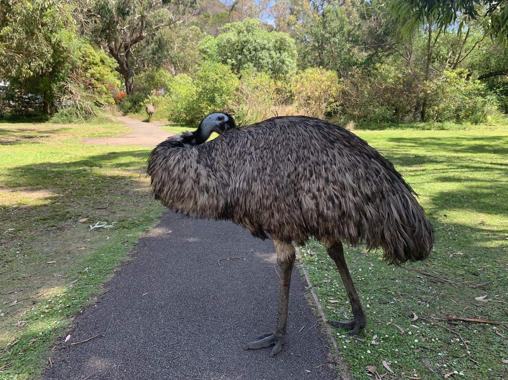
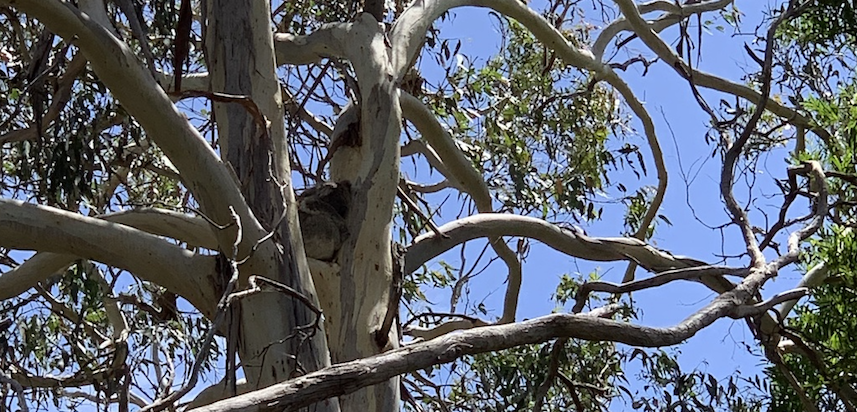
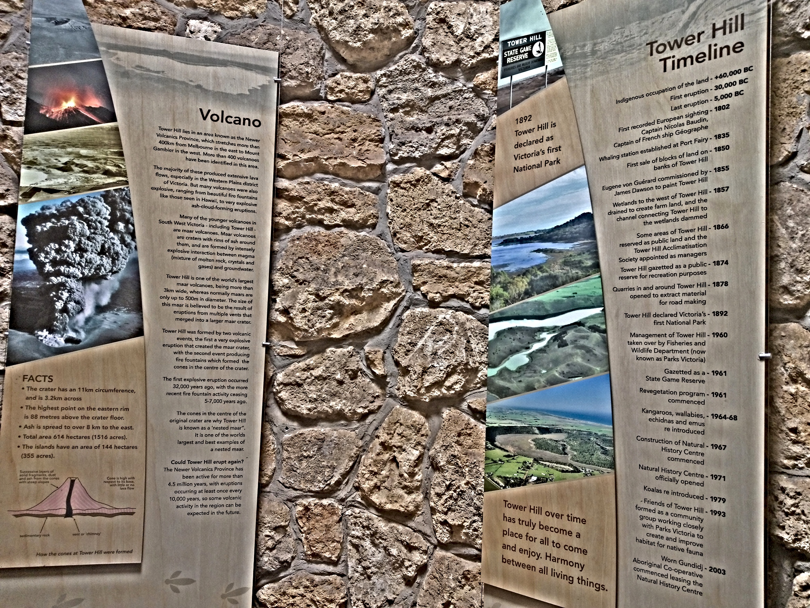
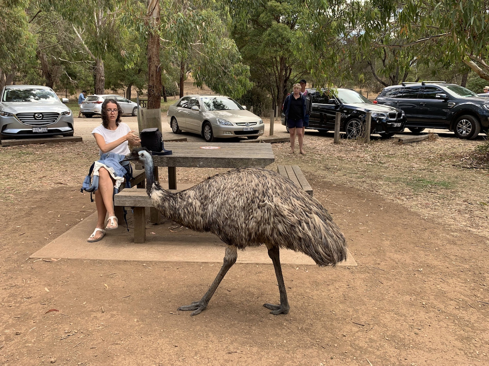
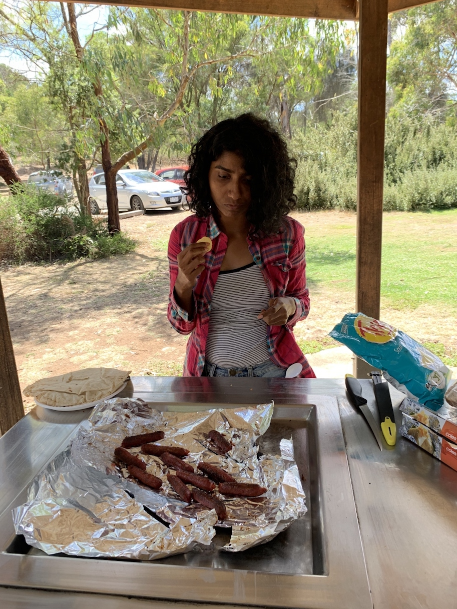
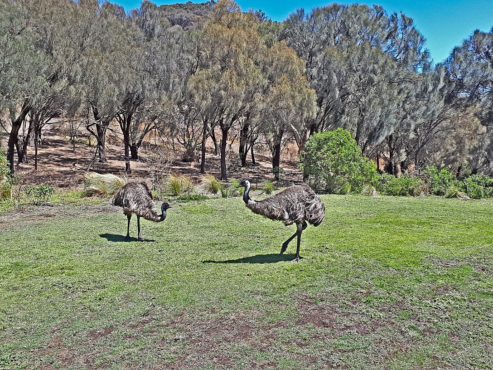
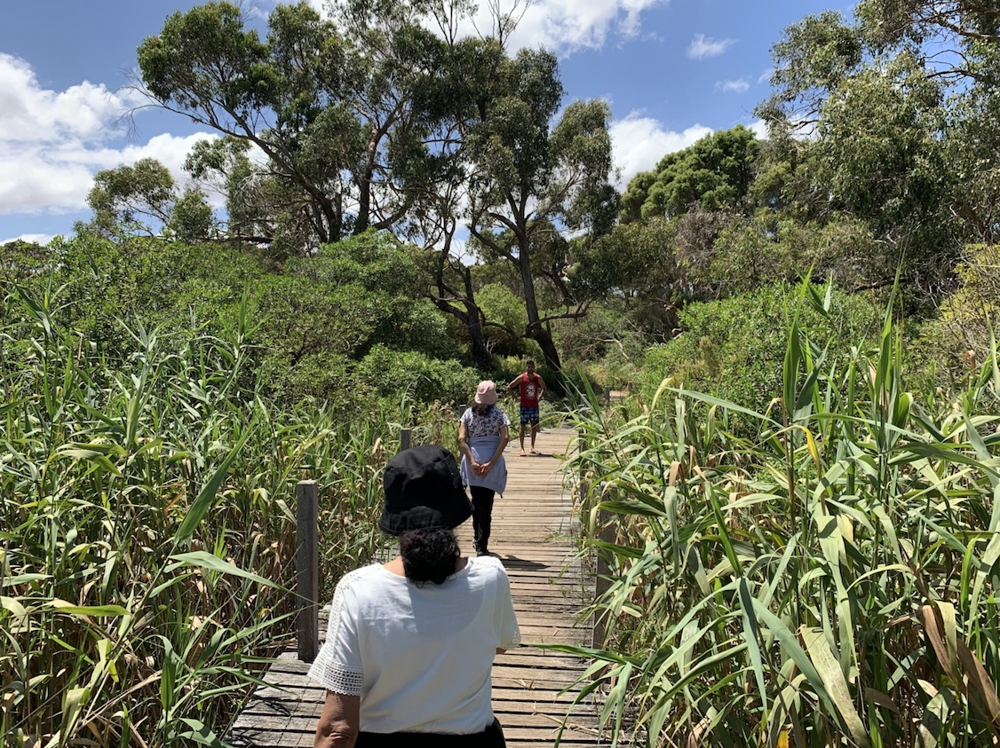

When you think Australia what is your first thought? Before my move to Australia, I always imagined it to be a land full of kangaroos. Especially after all the Steve Irwin shows
Silly me! But the truth to be told,it is exactly what i dreamt it to be.
Wild life and in the wild is what you will get here.

And I wanted my parents(yup folks visiting their darling daughter) to be awed by this experience.

Over the Australia Day,we took them to see the iconic 12 Apostles along the Great Ocean Road. There are many spots to see koalas in the wild

- On the way to Cape Otway Lighthouse
- Koala Cafe, near Kennett River
  However tourists are many and koalas few.
  
  For our 2 nights stay we chose to stay at a AirBnB ,Port Fairy.
  As we drove towards our accommodation , we saw a sign that mentioned TowerHill Reserve. On googling ,it seemed to be a nice place to view koalas and emus!!! I have never seen an emu in d wild and we knew exactly what we were doing for lunch.

The road is well signed and the Towerhill Reserve entrance has these amazing sand swept hills. I shrieked at the random sight of two emus cruising by just as we entered. O what joy!!
There is a different thrill to seeing animals in the wild .

> The Reserve sits inside a dormant volcano .Within its spectacular 11km crater rim, the volcanic cones rise from a lake bed in a formation known as a nested maar, which occurred as a result of the volcanic dome collapsing on itself due to weight.

The facility has electric bbqs and a nice picnic area. However there is no drinking water or rubbish bins . Please make sure you have covered these two. We expected emus to be hanging out near the bbq areas for obvious reasons spelt F-O-O-D!
But much to our dismay there was a lonely ranger.

We threw a couple of sausages on the grill and enjoyed a good lunch . Our eyes tracking the emus movements. Things to appreciate is no-one feed the emu!! Its so good to see tourists abiding and respecting laws of the government and nature!

The reserve offers both guided and self-guided tours to admire the volcano, old lava flow, wetlands, birdlife and Aboriginal heritage of the area. With our bellys full , we headed onto a walking trail The only wish was to spot koalas.
So the national park is a crater and is surrounded by water. So you have dense forests as well as marshy areas.

> HEADS UP - SNAKES GALORE!!

It could be the water and the heat which draws them out . However there are multiple signs to remind you to stay out of trouble.
The emu is such a majestic bird, always referred to the poorer cousin of the ostrich. But now it makes sense, why this country choose it as their national bird.

We did a boardwalk with my folks.I am not sure if the snake signage make it scary or that with the surroundings.Imagine doing a boardwalk with tall greens on both sides on a marshy ground. This ambience was short and we were in between tall eucalyptus trees soon. In most places, eucalyptus trees spell Koalas! And then we spotted our first ball of fur snuggled tight on a tree branch. Few steps and our next sighting! I was exactly like that kid in a candy store. Excitement and pure joy! This continued for the remainder part of our walk.
We did see a couple of slittery lizards (wished it was a blue tongue) along the walk.
The walk is flat and pretty easy. It is the perfect way to breathe in nature. We were slow paced because of my folks and spotting koalas. The walk is also completely shaded so perfect for a hot summer day.We completed the walk in an hours time .
Danny and myself went for the walk along the rim of the crater . The walk is a 3 hour long one but could not complete it due to shortage of time. We would surely want to do it if we vist again.

In all, emus were the clear winner!!! Would definitely recommend this place if you are looking for a easy trail and some wildlife spotting
