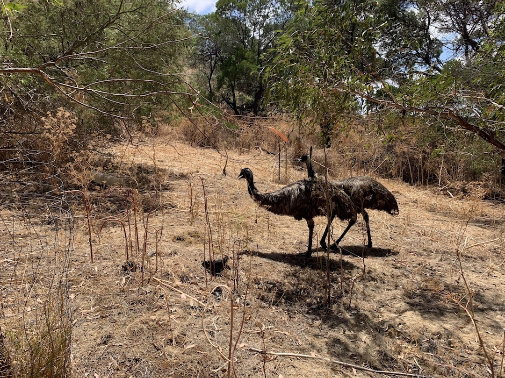

When you think Australia what is your first thought? Before my move to Australia, I always imagined it to be a land full of kangaroos and koalas. Binge watching Steve Irwin shows maybe!
Silly me! But the truth to be told,it is exactly what I dreamt it to be.
Wild life and in the wild - is what you will get here.

And I wanted my parents(yup folks visiting their darling daughter) to be awed by this experience.

Over the Australia Day,we took them to see the iconic 12 Apostles along the Great Ocean Road. There are many spots to see koalas in the wild

- On the way to Cape Otway Lighthouse
- Koala Cafe, near Kennett River
  

  For our 2 nights stay we chose to stay at a AirBnB in Port Fairy.
  As we drove towards our accommodation , we saw a sign that mentioned TowerHill Reserve. On googling ,it seemed to be a nice place to view koalas and emus. E-M-U! I had never seen an emu in the wild before and that moment we knew exactly what we were doing for lunch the next day.

The road is well signed and the Towerhill Reserve entrance has these amazing sand swept hills. I shrieked at the sight of two emus cruising by just as we entered. Wow!
There is a different thrill to seeing animals/birds in the wild .

> The Reserve sits inside a dormant volcano .Within its spectacular 11km crater rim, the volcanic cones rise from a lake bed in a formation known as a nested maar, which occurred as a result of the volcanic dome collapsing on itself due to weight.
> 

The facility has electric barbecues and a nice picnic area. However there is no drinking water or rubbish bins within the premises. Make sure you have these covered. We expected emus to be hanging out near the barbecues areas for obvious reasons spelt F-O-O-D!
But much to our dismay there was a lonely ranger.

We threw a couple of sausages on the grill and enjoyed a good lunch with my eyes peeled for emus. The thing to appreciate is no one feed the emu!! It is so good to see tourists abiding and respecting laws of the government and nature.

The reserve offers both guided and self-guided tours to admire the volcano, old lava flow, wetlands, birdlife and Aboriginal heritage of the area. With our bellys full, we headed onto a walking trail .My silent wish - to spot koalas.

As the national park is a crater surrounded by water ,you have dense forests as well as marshy areas.

> HEADS UP - SNAKES GALORE!!

It could be the water and the heat which draws the reptile out . However there are multiple signs to remind you to stay out of trouble and out of their way.

The emu is such a majestic bird, always referred to the poor cousin of the ostrich. But now it makes sense, why this country choose it as their national bird.

We did a boardwalk with my folks.I am not sure if the snake signage made it scary or was it the dense mangroves.Imagine doing a boardwalk with tall greens on both sides on a marshy ground. This walk was short and we were soon in between tall eucalyptus trees. In most places, eucalyptus trees spell Koalas! We spotted our first ball of fur snuggled tight on a tree branch. Few steps and our next koala! I was exactly the kid in a candy store. Excitement and pure joy. These sightings continued for a major part of the walk.We did see a couple of slithery lizards (wished it was a blue tongue) along the walk.

The walk is flat and pretty easy. It is the perfect way to breathe in nature. We were slow paced because of my folks and koala-spotting. The walk is also completely shaded so perfect for a hot summer day.We completed the walk in an hours time .

The next walk was along the rim of the crater. The walk is a 3 hour long one but we could not complete it due to time. We would surely want to do it on our next visit.

In all, emus were the clear winner.We would definitely recommend this place if you are looking for a easy trail and some wildlife action.

The next time you are around Port Fairy, make sure you have this one locked in.
You can thank me later;)
