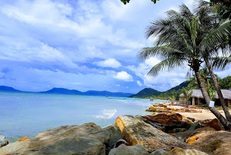
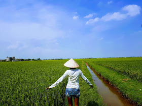

Vietnam has the reputation of being a backpackers haven. It is a vast country and has a lot to see. Armed with this information I thought 3 weeks is good enough for a holiday and exactly 23 days later with \$1500 AUD /person (this includes E-V-E-R-Y-T-H-I-N-G) lighter, we returned home.

So you are thinking in your head , the country is low-cost,the most I would spend is on my flight ticket, how much cheaper can this get now!! Well we got our 'no check-in' return tickets for 2 adult for a whooping \$780 AUD. If Jetstar ever knew of our existence, it would strictly be because of our names on the cheapest travellers list (if there was any!) It is official! Booking cheap flight tickets gives me immense happiness and pride. Also Jetstar is my favourite airline coz of their fab deals*-*

**Our trip breakdown**
Travel duration- _20May -13th June_
Weather in Vietnam - _Hot and humid_

We did 3 domestic one way flights. This cost has been factored under Flights.

1.  Ho Chin Minh City (HCMC) -> Hanoi (Jetstar)
2.  Da Nang -> HCMC (VietJet)
3.  HCMC ->Phuc Quoc (VietJet)

| Syntax              | Description |
| ------------------- | ----------- |
| Activity            | Cost        |
| Flights             | \$ 750 AUD  |
| Standard Room Rents | \$300 AUD   |
| Food/Alcohol        | \$250 AUD   |
| Miscellaneous       | \$200 AUD   |

**Stay**
Throughout our stay we spent in the country, we never pre booked hotels. We did use booking.com to search for a hotel within our budget. We would go to the hotel directly and ask for room rental. Most of the times they would give it to us cheaper than what it was listed for. We stayed in AC rooms for approximately \$10 AUD per night. This was partly cause it was off season. But we saw so many tourists that it would be hard to gauge what it is like at peak season.
If your lucky you could have your breakfast of a simple egg with toast and coffee covered.

**Travel within the city**
Like most Asian countries, Vietnam too is a bike nation. The two wheeler is the most convenient and popular mode of transport. There are bike rentals all over and you can bargain for a decent price. If you haven't ridden a bike before, you may want a practice ride and they generally help you with it. Also you don't need a licence to ride. You might have to hand over your passport at the rental for safe-keep. However if you are not comfortable doing so , Don't do it!
Incase you keen on a motorbike trip across the country, there is the option to pick the bike at Hanoi or Ho Chin Minh and drop it off at the city you end your travel at.
Beware of motorbike accidents though.

**Things to keep in mind**

- Vietnam is an extremely beautiful country and we came across some of the warmest people here.
  Although English isn't spoken, for tourism locals use Google Translate which helps communication.
  When in doubt , use Google Translator!

- The Vietnamese Dong will make you feel like a millionaire. A bike hire for a day could be 200000 VND i.e. 11 AUD. It is best to exchange your currency in Vietnam as they have better rates. Also count your change to ensure that you are not dodged.

* Warm people| The locals here are extremely friendly. During our trip we met some really nice and warm people who even showed us around. The locals are keen on learning English and are encouraged to talk to foreigners.

* Since we are on the topic of Vietnamese lasting impressions, another Vietnamese delight is the coffee. Not your regular latte or cap.
  The Hanoi Egg/Rum/Beer coffee is iconic .Their everyday coffees have a distinct flavour.
  They have these unique percolator (we actually got back as keeps) have the strong blend with a generous scoop of condensed milk. Yup, regular milk is a rarity!!

* Vietnam is a shoppers paradise . I shopped the most in Hanoi. If you are looking for cheap yet good stuff there are a couple of shops like DT2000 and Blue which have stores all over. I bought myself clothes, shoes, bags which i could use here.

* Don't be in a rush to cover cities especially in Vietnam. It will always be that you have left some interesting place out . This is solely because Vietnam is vast country. You will never know Hanoi, Ninh Binh, Cat Ba, Phong Nha, Hue, Da Nang, Hoi An, Phu Quoc or Ho Chin Minh City (btw i just listed all the cities we covered ) until you savour them. Over the three weeks we could have covered many more places but wanted to relish our time rather than drift through. We ended up spending 2 nights and 3 days in Hue which is a relatively quite place with nothing much to site see.

* Food ! The biggest reason to pick Vietnam was the food. We ate some memorable food here. From the sea urchin(apparently aphrodisiac ) to worms , the freshest herbs to dips , warm pho to cold salads everything was flavoursome. Each city has its speciality that is sold on the streets. To get a feel of the country we ate at road side eateries. The one stand out was the hygiene. Except for few areas in Ho Chin Minh City, most street stalls are very clean.We felt comfortable to eat there and _touch wood_ never fell sick.

* The tropical fruits are a-maz-zing! They have smoothies , milkshakes of every kind and man! are they yummm.. If fruits are not your thing, they serve some really good milk tea with sago and rice jelly. Such sweet treats make happy endings. I could literally write another blog on the food served there.With water, however ,you would never want to risk it. Make sure you carrying your bottled water everywhere.

In short Vietnam sure does have something for everyone and honestly 3 weeks is quite short to travel in Vietnam.
Would we go back ? Hell ya!!!
