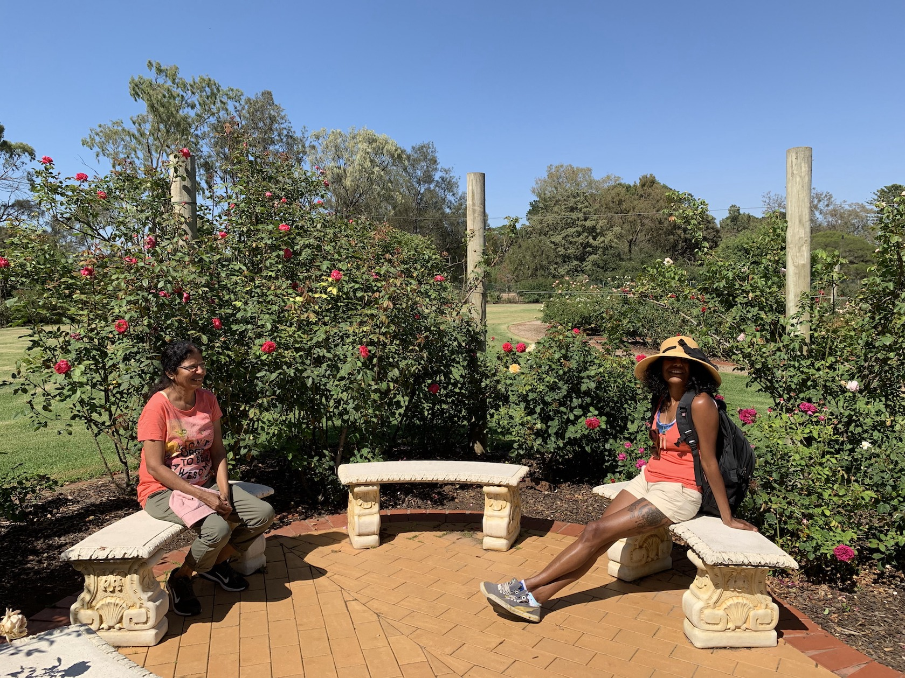

This weekend we went took time to smell the roses. Figuratively and literally.

Melbourne is on a heat roll! We have had a good few weeks of sunshine and we thought of taking the folks to the Werribee Zoo Safari.
The best thing about this tourist place is that Werribee State Mansion, State Rose Garden and the Werribee Zoo are also in the vicinity.
Which means if either of them is not your thing you can easily move on to the next.

This post is solely about the rose garden and this does not imply that we did not have a great time at the zoo. The safari was good but we enjoyed the garden more.

It is my second visit to the rose garden. I know of many who visit the zoo and are oblivious to the next door neighbor. I don't think that it is fair but that could be just me.

> The entry to the garden is free. I told ya, best things in life are for free.
> 
> As you enter there there is spectacular display of roses to welcome you. 5000 variety of roses have been nurtured over the 5 acres.
> You are hit by a the colour bomb as you walk into the garden. You simply have to stop and smell the roses!
> 

As you continue taking in the sights, the scene just gets better. The
beautiful Gazebo at the heart of the garden has a nice Victorian vibe.
The aisle are lined with roses bushes

We visited the garden early Feb. In spite of the spiteful heat over the paste weeks, the garden was full blooms.

Volunteers work precariously for the upkeep of the garden. Awarded the International Garden of Excellence by the World Federation Of Rose Societies in 2003, it was the first rose garden outside of Europe to receive this Award and the only one (at that time) cared for entirely by volunteers.

The garden has a well curated show of roses. The constant stream of people wanting to take pictures with the beautiful blooms. We were no exceptions!!
The garden does have benches where you just take a break .

The lawns surrounding the garden are perfect for a family picnic.

We spend two hours just walking and looking for photo opportunities.
The arches or the runners! Its hard to choose where to pose so you might as well pose with both.

My mother thoroughly enjoyed the roses and cant wait to go again.

