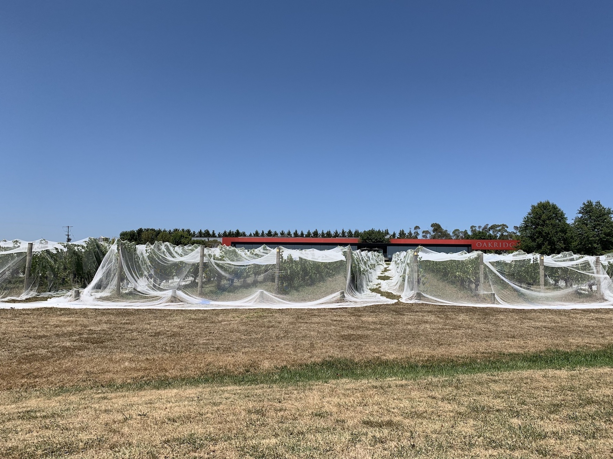
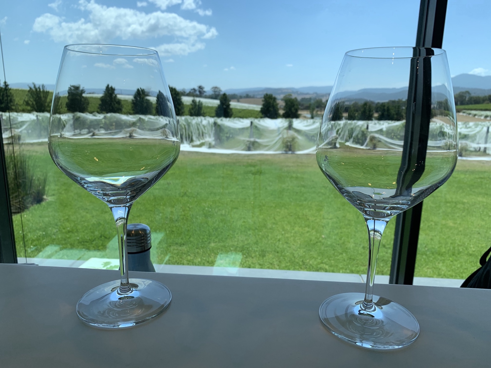
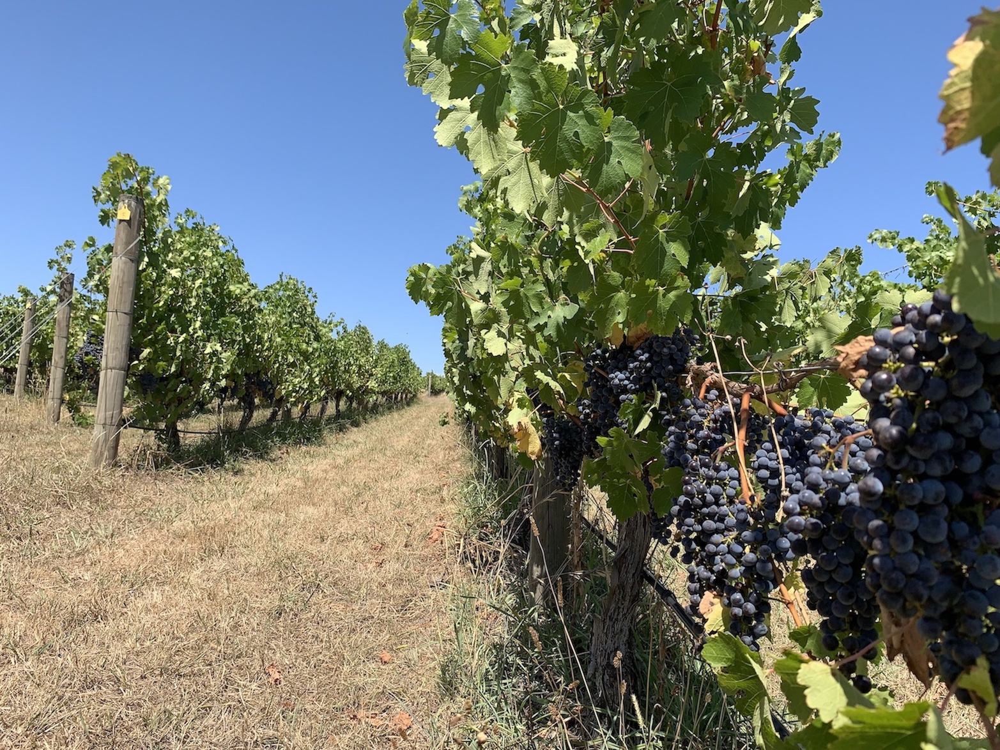
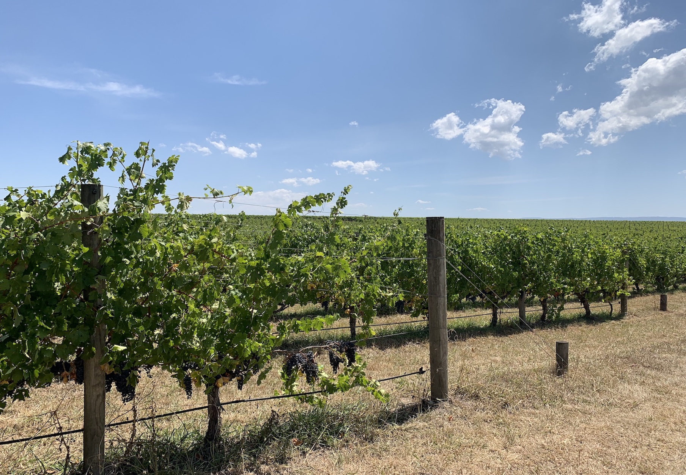

Yarra valley needs no introduction. It is the wine glass of Victoria.
At about an hours drive from Melbourne CBD, it makes for the perfect weekend day-trip.
Our generally routine to show visitors around the valley is

- winery no 1
- yarra valley dairy
- winery no 2
- yarra valley chocolaterie
  The vineyards are so picturesque that you cannot help but pose for some get shots.

First up Oakridge Vineyards.

My cup runneth over

